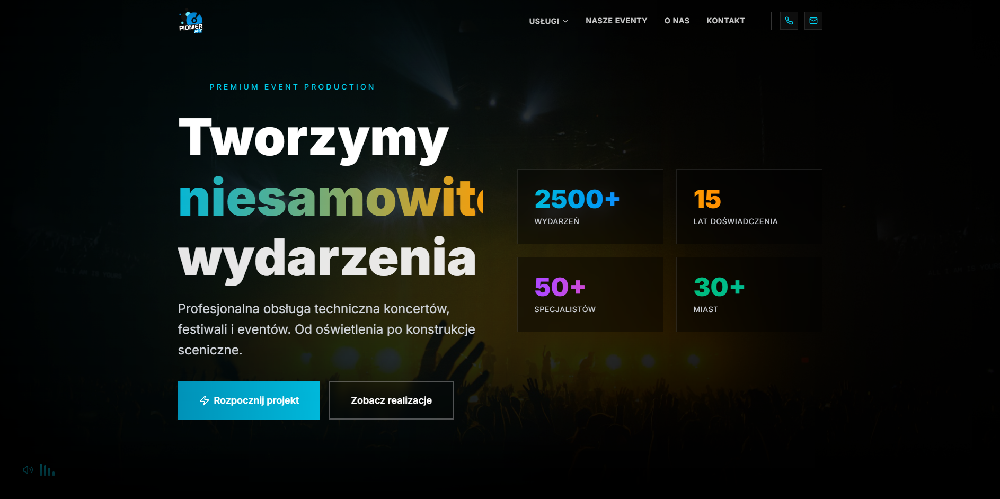
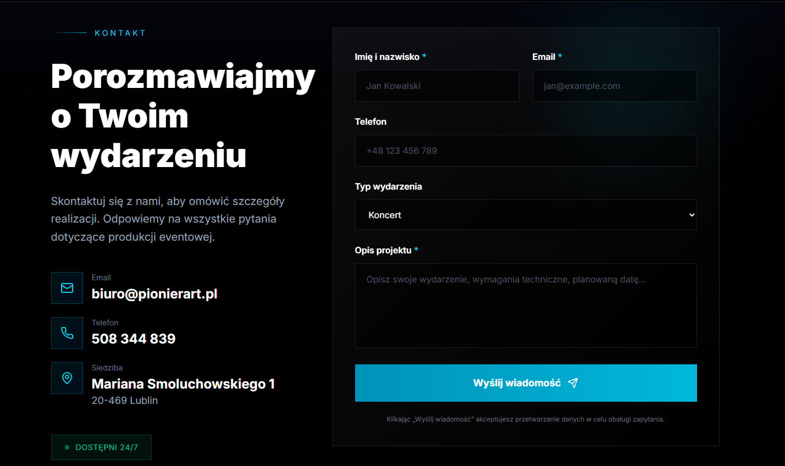
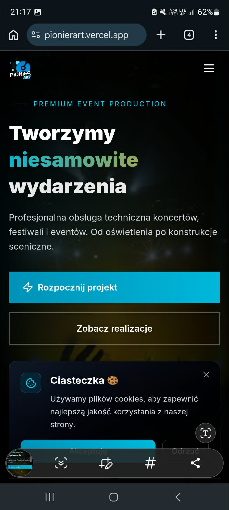
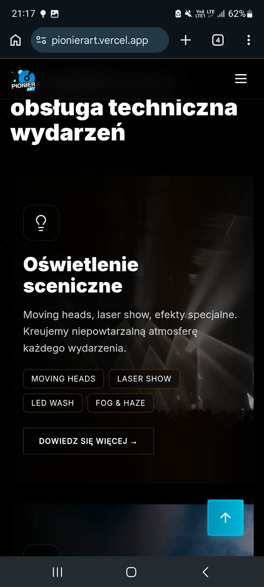

# PionierART

### Commercial Event Production Company Website

Modern marketing website developed for a company specializing in technical support for concerts, festivals, conferences, and large-scale events.

---

## Live Website

🌐 https://pionierart.vercel.app/

---

## Overview

PionierART is a commercial website developed for an event production company providing professional technical services for live events.

The website was designed to strengthen the company's online presence, showcase its service offering, and create a clear communication path for potential customers.

The project combines modern UI design, smooth animations, responsive layouts, and conversion-focused user journeys.

---

## Project Type

**Commercial Marketing Website**

---

## Business Goals

* Present company services
* Increase brand visibility
* Showcase completed projects
* Improve customer communication
* Generate new business inquiries

---

## Features

### Service Presentation

Dedicated pages for:

* Stage Lighting
* Sound Systems
* Multimedia Solutions
* Stage Structures
* Power Generators

### Lead Generation

* Contact form
* Client-side validation
* Direct contact information
* Social media integration

### User Experience

* Fully responsive design
* Animated page transitions
* Scroll-based interactions
* Intro animation
* Cookie consent management
* Legal information pages

---

## Technology Stack

### Frontend

* React 18
* TypeScript
* React Router
* Vite
* Tailwind CSS

### UI & Animation

* Motion
* Radix UI
* Material UI
* Lucide React

### Forms & Validation

* React Hook Form

### Additional Libraries

* React Helmet Async
* Sonner
* Embla Carousel
* React Slick
* Recharts

---

## Technical Highlights

### Responsive Design

The website is fully optimized for desktop, tablet, and mobile devices.

### SEO Optimization

Dedicated metadata management improves visibility and search engine indexing.

### Reusable Page Architecture

Service pages follow reusable design patterns to maintain visual consistency and simplify maintenance.

### Animation System

Motion-based interactions create engaging transitions and improve overall user experience.

### Form Validation

Client-side validation ensures data quality before submission.

### Cookie Preference Persistence

User preferences are stored locally to improve compliance and usability.

---

## Project Gallery

### Homepage

### Contact Section

### Mobile Experience

---

## Source Code Availability

Source code is private due to commercial agreements and intellectual property considerations.

This repository serves as a showcase of the project's design, technologies, and implementation approach.

---

## Author

### Adam Jastrzębski

---

## Acknowledgements

This project utilizes selected components and design patterns based on:

* shadcn/ui
* Radix UI
